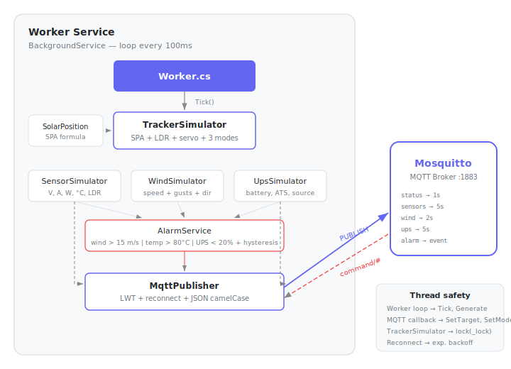

# Solar Tracker API

Backend for a 2-axis solar tracker (azimuth + elevation) for a 200W panel controlled by STM32 via WiFi.

## Stack

- .NET 9, Minimal API, Vertical Slices
- EF Core + PostgreSQL
- SignalR (real-time push)
- MQTTnet (communication with controller/mock)
- Docker Compose (Mosquitto + PostgreSQL + MockController)

## Solution structure

```
SolarTracker.sln
├── src/SolarTracker.Api/             — Minimal API + SignalR + MQTTnet
├── src/SolarTracker.MockController/  — Worker Service simulating STM32
└── src/SolarTracker.Shared/          — MQTT models (DTOs, enums, constants)
```

## MockController

Simulates the STM32 controller — generates telemetry and publishes it to Mosquitto via MQTT. Subscribes to movement and mode commands.



**Services:**

| Service | Role | Interval |
|---------|------|----------|
| `TrackerSimulator` | Solar position (SPA) + LDR correction + servo movement, 3 modes (Auto/Manual/Parking) | tick 100ms |
| `SensorSimulator` | Voltage, current, power, temperature, LDR readings | 5s |
| `WindSimulator` | Wind speed with gusts + direction drift | 2s |
| `UpsSimulator` | Battery level, ATS switching, power source | 5s |
| `AlarmService` | Threshold evaluation with wind hysteresis | 5s |
| `MqttPublisher` | MQTT client with LWT, reconnect, JSON camelCase | — |

**MQTT Topics:**

| Topic | QoS | Direction |
|-------|-----|-----------|
| `solar-tracker/telemetry/status` | 0 | mock → broker |
| `solar-tracker/telemetry/sensors` | 0 | mock → broker |
| `solar-tracker/telemetry/wind` | 0 | mock → broker |
| `solar-tracker/telemetry/ups` | 0 | mock → broker |
| `solar-tracker/alarm` | 1 | mock → broker |
| `solar-tracker/command/move` | 1 | broker → mock |
| `solar-tracker/command/mode` | 1 | broker → mock |
| `solar-tracker/status/connection` | 1 | LWT + retain |

## Getting started

```bash
docker compose up -d
dotnet run --project src/SolarTracker.Api
```
